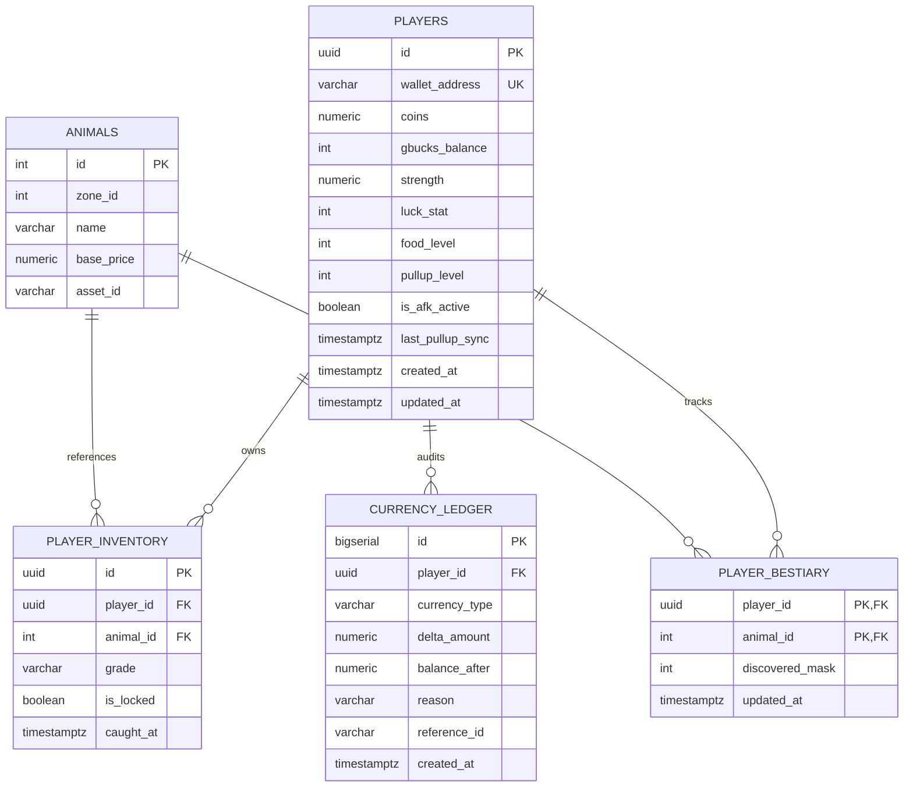

# Entity Relationship Diagram (ERD)

```mermaid
erDiagram
    PLAYERS ||--o{ PLAYER_INVENTORY : owns
    PLAYERS ||--o{ PLAYER_BESTIARY : tracks
    PLAYERS ||--o{ CURRENCY_LEDGER : audits
    ANIMALS ||--o{ PLAYER_INVENTORY : references
    ANIMALS ||--o{ PLAYER_BESTIARY : discovers

    PLAYERS {
        uuid id PK
        varchar wallet_address UK
        numeric coins
        int gbucks_balance
        numeric strength
        int luck_stat
        int food_level
        int pullup_level
        boolean is_afk_active
        timestamptz last_pullup_sync
        timestamptz created_at
        timestamptz updated_at
    }

    ANIMALS {
        int id PK
        int zone_id
        varchar name
        numeric base_price
        varchar asset_id
    }

    PLAYER_INVENTORY {
        uuid id PK
        uuid player_id FK
        int animal_id FK
        varchar grade
        boolean is_locked
        timestamptz caught_at
    }

    PLAYER_BESTIARY {
        uuid player_id PK,FK
        int animal_id PK,FK
        int discovered_mask
        timestamptz updated_at
    }

    CURRENCY_LEDGER {
        bigserial id PK
        uuid player_id FK
        varchar currency_type
        numeric delta_amount
        numeric balance_after
        varchar reason
        varchar reference_id
        timestamptz created_at
    }
```
